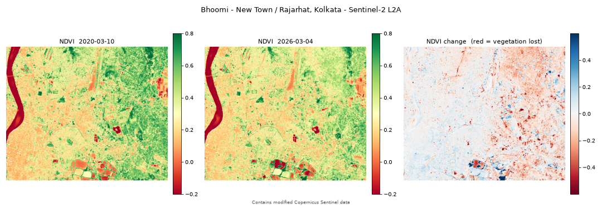

# Bhoomi

**On-demand Earth Observation processing for Indian and open satellite data.**

Bhoomi does not display pre-made map layers. It performs geospatial computation on demand and
returns a standards-compliant raster product that another GIS tool can consume.

> ⚠️ **Early development.** Scene search works end to end — draw an area, get real Sentinel-2
> scenes. Server-side processing arrives in January 2027. See [Status](#status).
> Development runs August 2026 – March 2027.



---

## What problem does it solve?

Producing a derived product from satellite imagery normally means: search a catalogue → obtain
scenes → open them in desktop GIS → clip → select bands → compute → export → publish. Seven
manual steps, desktop-bound, not reproducible, not scriptable, not shareable as a live result.

Bhoomi collapses that into one request, over an API, with a URL as the output.

## How is it different from a GIS viewer?

A viewer serves pixels somebody already computed. Bhoomi reads only the bands and the window a
request needs — over HTTP range requests, without downloading whole scenes — masks cloud,
harmonizes reflectance, computes the index, and writes a Cloud-Optimized GeoTIFF that QGIS,
TiTiler or any STAC-aware client can read.

The difference matters. Working through the Kolkata example below, four successive methods gave
four different answers, and **no viewer would have caught any of the errors**:

| Method | Claimed vegetation loss |
|---|---|
| SCL class counts | −66 % |
| NDVI, two dates | −16 % relative |
| NDVI + NDBI, two dates | "85.9 % of loss is construction-like" |
| **NDVI, 7-year recovery test** | **16.6 % of loss is permanent = 1.44 % of the AOI** |

Each step cut the headline by roughly 4×, and each cut came from a control the previous step
lacked. The last number is small, and it is the only one that survives scrutiny.

## Architecture

```
Next.js + MapLibre  ->  FastAPI  ->  Redis + RQ  ->  Python worker
                            |                         (rasterio, numpy)
                            v                              |
                       PostGIS   <---------------------    v
                                                    Cloud-Optimized GeoTIFF
                                                           |
                                                       TiTiler -> XYZ tiles
```

Raster work never happens inside an HTTP request. Jobs are queued, and the same queue is what
makes an OGC API – Processes async execution model natural rather than bolted on.

## Which standards?

- **STAC** — catalogue search (Element84 Earth Search, `sentinel-2-l2a`)
- **Cloud-Optimized GeoTIFF** — all outputs, validated before a job is marked complete
- **OGC API – Processes** — planned; the acceptance test is executing a process from a Python
  script with no browser involved

## What data?

| Source | Status |
|---|---|
| **Sentinel-2 L2A** | Working. Anonymous COGs on AWS, read via HTTP range requests. |
| **NRSC Bhoonidhi** | Planned. Under Indian Space Policy 2023, data ≥ 5 m is free and open; no public API is documented, so this uses a download-and-stage path. |

## Status

| Component | State |
|---|---|
| `processing/` — the raster library | **Working**, 93 tests passing |
| `catalogue/` — STAC client | **Working** — search, scene lookup, deduplication |
| `pipeline.py` — composition layer | **Working** — AOI + dates in, COG out |
| `examples/` — worked Kolkata analyses | **Working** |
| FastAPI — `/health`, scene search, `/docs` | **Working** |
| Next.js + MapLibre — draw, search, results | **Working** |
| Docker Compose | Written, **not yet run** — no Docker on the dev machine |
| PostGIS scene caching | Not started |
| Job queue, worker, TiTiler | Not started (January 2027) |
| OGC API – Processes | Not started (February 2027) |

## Running it

The whole stack, from a clean clone:

```bash
cp .env.example .env
docker compose up --build
#  frontend  http://localhost:3000
#  API       http://localhost:8000/docs
```

Or without Docker:

```bash
pip install -r requirements-dev.txt
python -m pytest

# API on :8000
uvicorn backend.api.main:app --reload

# frontend on :3000, in another shell
cd frontend && npm install && npm run dev
```

### The analyses

```bash
# Fetch the demo bands (reads only the AOI window from remote COGs)
python probes/clip_demo_aoi.py

# AOI + date range -> STAC search -> NDVI -> validated COG
python examples/search_and_process.py

# NDVI, NDBI, and the two-date change analysis
python examples/kolkata_change.py
python examples/kolkata_ndbi.py
```

The 7-year analysis needs its cache built first (~10 minutes of network):

```bash
python probes/cache_series.py
python examples/kolkata_timeseries.py
```

## Repository layout

```
backend/      FastAPI -- HTTP and nothing else
  api/routes/     health, scenes
  api/schemas.py  request/response models
  api/errors.py   messages that say what to do about it
frontend/     Next.js + MapLibre -- AOI drawing, scene browsing
catalogue/    STAC client -- no web framework, testable without a server
  base.py         Scene, SearchQuery, Catalogue protocol
  earthsearch.py  Element84 Earth Search, with retry and deduplication
pipeline.py   composition -- the only module importing both libraries
processing/   pure raster library -- no web dependencies, importable from a notebook
  harmonize.py    DN -> reflectance, with pixel-based offset detection
  masking.py      SCL cloud and shadow masking
  raster_utils.py Grid, AOI snapping, windowed reads (local or HTTP)
  indices.py      NDVI / NDWI / NDBI
  change.py       two-date differencing and compatibility checks
  cog.py          COG writing, validation, provenance tags
examples/     worked analyses over Kolkata
probes/       measurement scripts -- every empirical claim in PLAN.md is re-runnable
tests/        93 unit tests, none requiring network
docs/         data-source notes and the Bhoonidhi access request
PLAN.md       the full project plan, with a live decisions register
```

`catalogue/` and `processing/` never import each other, and neither imports the backend. The
only module that knows both is `pipeline.py` — the seam the worker will call, so the web layer
adds HTTP and nothing else. It is also what lets Bhoonidhi arrive later as a second `Catalogue`
implementation without touching any raster code.

## A note on the hard part

The riskiest code in this project is nine lines in `harmonize.py` that decide whether to
subtract 1000 from a pixel value. Three separate metadata fields claim to answer that question
and **all three are unreliable** — one field means "offset present" on a 2022 scene and "offset
absent" on a 2025 scene. Getting it wrong does not crash anything; it silently shifts NDVI by
~0.24 while leaving every value inside its valid range.

The answer is to detect it from the pixels: the offset is exactly 1000 DN, and reflectance
cannot be meaningfully negative, so a scene carrying the offset has essentially no pixels below
~800 DN. Measured across seven scenes, the offset-bearing one had 0.00 % of pixels below 700 DN
and the other six had 3.48–8.17 %.

See [`PLAN.md`](PLAN.md) §5.3.

## Licence and attribution

Code: Apache-2.0. See [LICENSE](LICENSE).

Sentinel-2 data is provided under the Copernicus licence. Outputs carry the required
attribution — *"Contains modified Copernicus Sentinel data"* — embedded in the COG metadata, so
it survives download.

Bhoonidhi/NRSC terms are under review and no Bhoonidhi data is redistributed by this project.
