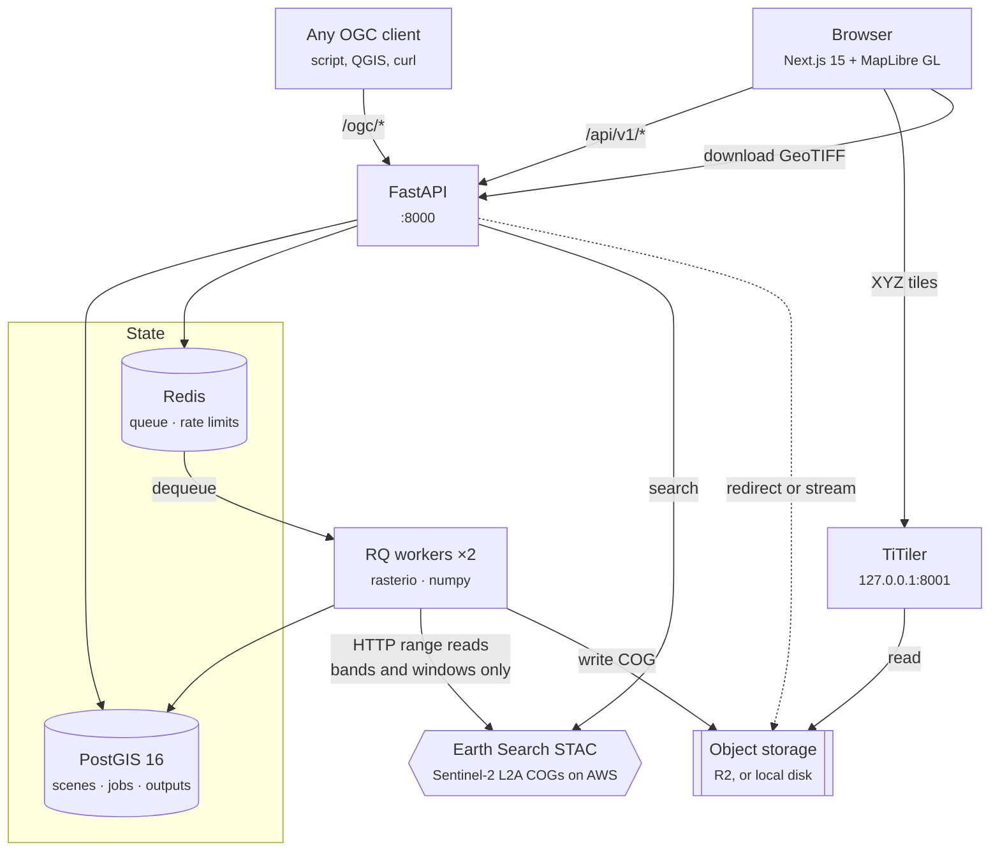
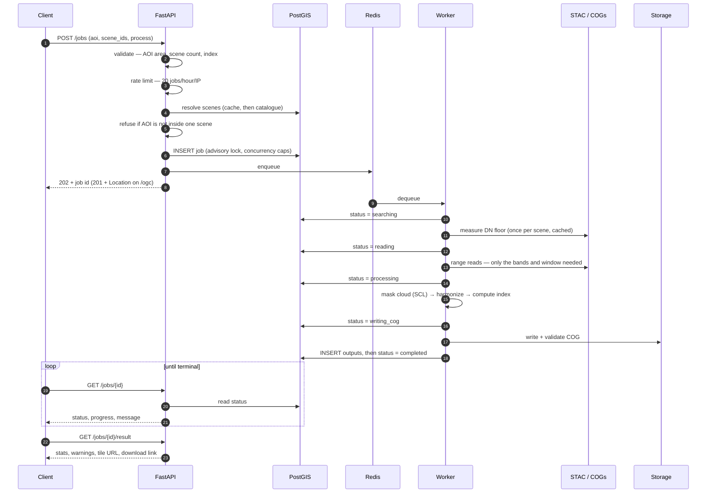
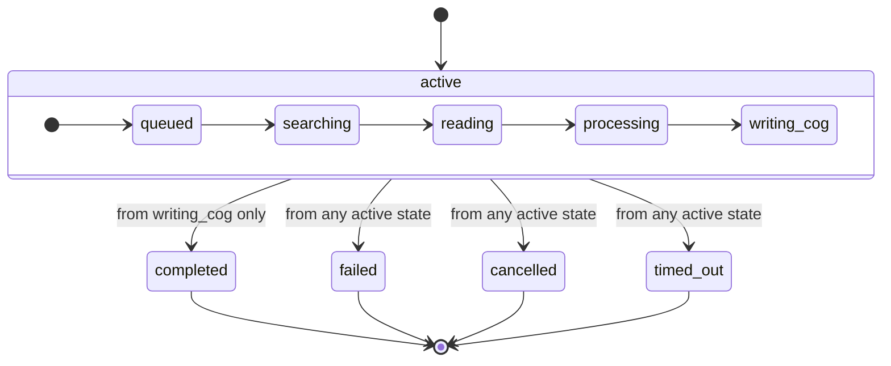
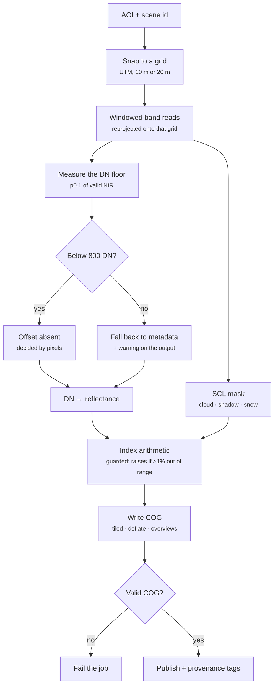

# Architecture

How Bhoomi is put together, and why. Every diagram here is Mermaid rather than an image, so it
renders on GitHub, survives a rename, and shows up in a diff when the design changes.

The short version: **raster work never happens inside an HTTP request.** Everything else follows
from that.

---

## 1. The running system

**Two front doors, one queue.** `/api/v1` is what the web interface uses; `/ogc` is
[OGC API – Processes Part 1: Core](https://ogcapi.ogc.org/processes/). Both call the same
`backend/api/submit.py`, so a job submitted through the standard cannot be validated differently
from one submitted natively. The OGC layer adds request and response *shapes* and nothing else.

**The worker never downloads a scene.** Sentinel-2 tiles are ~1 GB; an analysis needs two or three
bands over a few square kilometres. Rasterio issues HTTP range requests against the COGs on AWS
and reads only the bytes the window covers.

**TiTiler is bound to loopback on purpose.** While outputs live on a filesystem it will open
whatever path it is given, so a publicly reachable tile server is an arbitrary-file-read. Object
storage removes that rather than mitigating it — until then, do not expose it.

---

## 2. The dependency rule

The layering is not a diagram-only aspiration; it is checked by what the modules actually import.

```mermaid
flowchart LR
    subgraph libs["Pure libraries — no web, no database"]
        processing["processing/<br/><small>indices · masking · harmonize<br/>change · cog · raster_utils</small>"]
        catalogue["catalogue/<br/><small>STAC client, Scene, SearchQuery</small>"]
    end

    pipeline["pipeline.py<br/><small>the only module that knows both</small>"]
    backend["backend/<br/><small>HTTP, queue, storage, tiles</small>"]

    pipeline --> processing
    pipeline --> catalogue
    backend --> pipeline
    backend --> processing
    backend --> catalogue

    processing -.->|never| catalogue
    catalogue -.->|never| processing

    style processing fill:#1e3a2f,stroke:#2f6f4f
    style catalogue fill:#1e3a2f,stroke:#2f6f4f
```

Measured, not asserted — `processing/` and `catalogue/` import nothing from this project at all:

| module | imports from the project |
|---|---|
| `processing/` | *(nothing)* |
| `catalogue/` | *(nothing)* |
| `cache.py` | *(nothing)* |
| `pipeline.py` | `processing`, `catalogue`, `cache` |
| `backend/` | `pipeline`, `processing`, `catalogue` |

**Why it is worth the discipline.** `processing/` is importable from a notebook with no server
running, which is how every number in [`limitations.md`](limitations.md) was produced and
re-checked. The day `catalogue/` starts importing `processing/`, the mathematics becomes
untestable without a network.

---

## 3. What happens when you submit a job

Two orderings in there are deliberate and were bugs waiting to happen:

- **Outputs are inserted before `completed`.** The reverse would let a client that sees
  `completed` and immediately asks for the result get an empty outputs array — indistinguishable
  from a process that legitimately produced none.
- **The concurrency count and the insert share one transaction**, behind
  `pg_advisory_xact_lock`. Counting and then inserting is the classic check-then-act race: two
  submissions arriving together would both see one active job, both decide there was room, and
  both insert.

---

## 4. Job state machine

The grouping is not cosmetic: **every** active state can abort to any of the three terminals — a
failure, a cancellation or the 10-minute timeout can arrive at any point. Only `completed` is
restricted, reachable from `writing_cog` and nowhere else. Terminal states have no exits at all.

Progress is written on entry: `queued` 0, `searching` 10, `reading` 30, `processing` 60,
`writing_cog` 85, `completed` 100. Failure states keep whatever progress they reached, which says
more than resetting to 0.

**The legality check lives in the UPDATE's WHERE clause**, not in Python. Two workers racing
cannot both win, and a retry landing after a success cannot resurrect a finished job.

**Nothing in-process can report its own death.** A worker killed mid-job — RQ SIGKILLs a
work-horse that will not respond to its timeout, which happens when the job is blocked inside a
GDAL read — leaves a row stuck in an active state forever. Since that row counts against the
concurrency caps, one hard kill used to lock a client out permanently. `JobStore.reap_stalled`
closes such rows, and `create()` runs it inside the same lock as the count it corrects. See
`PLAN.md` §5.3.2.

---

## 5. Inside a job

**The harmonization branch is the highest-risk decision in the project.** Sentinel-2 products from
Processing Baseline 04.00 carry `BOA_ADD_OFFSET = -1000`, and no metadata field reliably says
whether a given product has it in its pixels. Getting it wrong shifts every value by ~0.24 while
leaving everything inside its valid range — no crash, no obviously wrong picture.

The test is deliberately **one-sided**: a low floor *proves* the offset absent, a high floor proves
nothing, because a bright desert tile and an offset-bearing scene are genuinely indistinguishable.
Where the pixels cannot decide, the decision falls back to metadata and the output carries a
warning saying so. Measured over 48 scenes; see [`limitations.md`](limitations.md) and `PLAN.md`
§5.3.1c.

**A change job publishes three rasters**, not one: the difference, plus the two per-date index
rasters it was taken between. A difference cannot be un-differenced — +0.3 could be bare ground
becoming scrub or forest becoming denser forest — so both sides are kept, which is also what makes
the before/after swipe possible.

---

## 6. Where things live

| Concern | Module | Note |
|---|---|---|
| Index mathematics | `processing/indices.py` | Raises rather than clamps when >1 % of pixels leave [−1, 1] |
| Cloud masking | `processing/masking.py` | SCL-based; a scene without SCL is processed unmasked **and says so** |
| Reflectance convention | `processing/harmonize.py` | The one-sided floor test |
| COG writing and validation | `processing/cog.py` | Validated before a job is marked complete |
| STAC search | `catalogue/earthsearch.py` | Retry, deduplication by acquisition |
| Composition | `pipeline.py` | AOI + scene → `IndexResult` / `ChangeResult` |
| Job submission | `backend/api/submit.py` | **Shared** by both front doors |
| State machine | `backend/db/jobs.py` | Transitions enforced in SQL |
| Storage | `backend/storage.py` | `Protocol`; local disk or S3-compatible |
| Tile URLs | `backend/tiles.py` | Ramp chosen per raster, not per job |

---

## 7. Decisions that shaped this

| Decision | Alternative | Why |
|---|---|---|
| Async queue | Compute in the request | A 500 km² job takes tens of seconds and can take minutes; an HTTP timeout is not an error message |
| RQ | Celery | One broker, no result backend to configure, the worker is a process rather than a framework |
| Hand-rolled OGC layer | Mount pygeoapi | ~400 lines against a second framework, its own config format, and a second path to the database |
| Storage behind a `Protocol` | Write to disk directly | Local disk needs worker and API to share a filesystem; object storage removes that, and the swap is an endpoint |
| Cache the *measurement*, not the verdict | Cache the offset decision | A verdict cannot survive a recalibration — one already cost a full cache purge. A raw floor does not move when a threshold does |
| Fixed [−1, 1] tile scaling | Per-image stretch | Two dates of the same area would get different scales, so comparing them visually would measure the stretch rather than the ground |

---

## 8. What this diagram does not show

- **It is not deployed.** Everything above runs locally or in Docker Compose. There is no public
  host, no live bucket, and no TLS story yet.
- **One scene per analysis.** An AOI crossing a scene boundary is refused rather than silently
  mosaicked.
- **No authentication.** Rate limits are keyed on IP, which is a throttle, not an identity — and
  the job list is public because of it.
